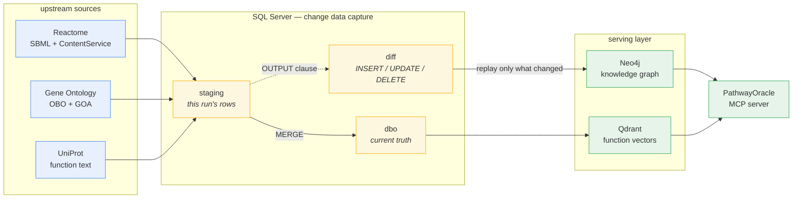
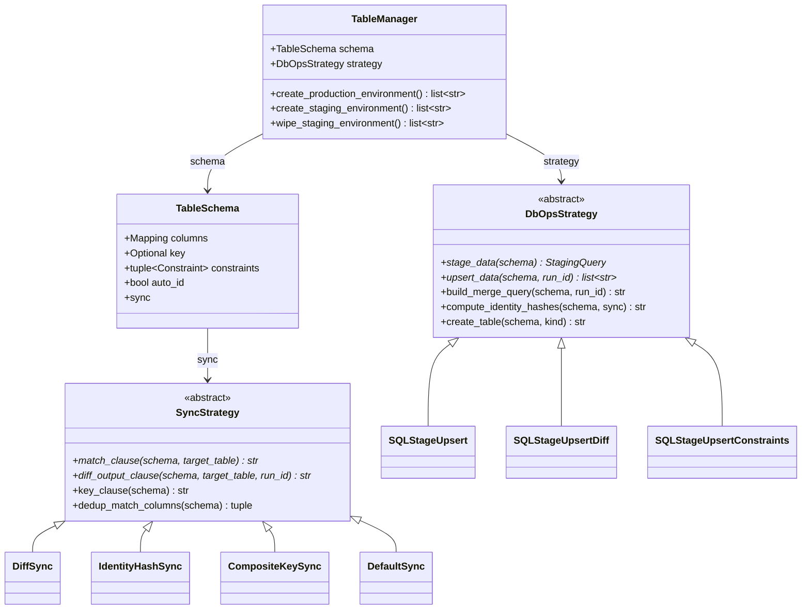
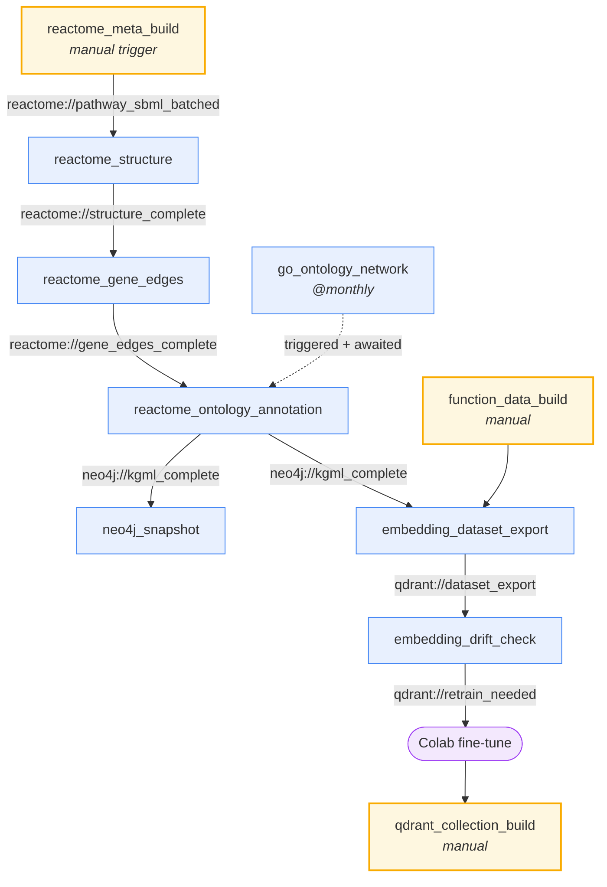
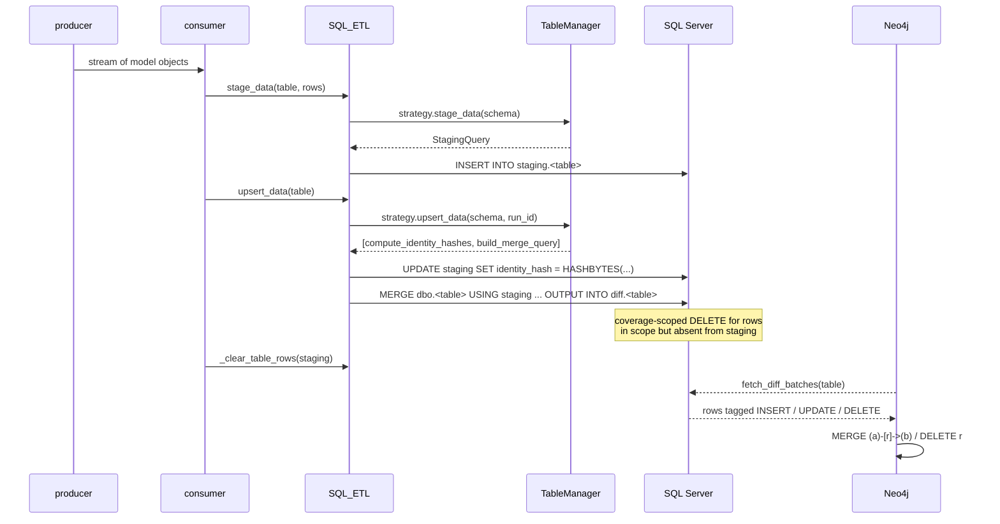
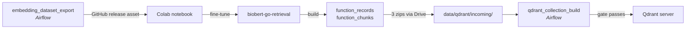
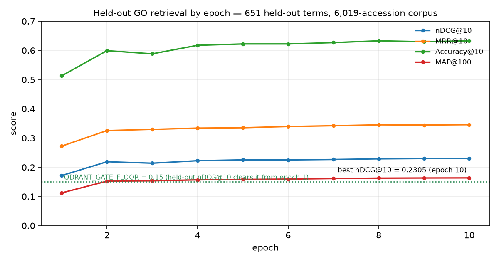
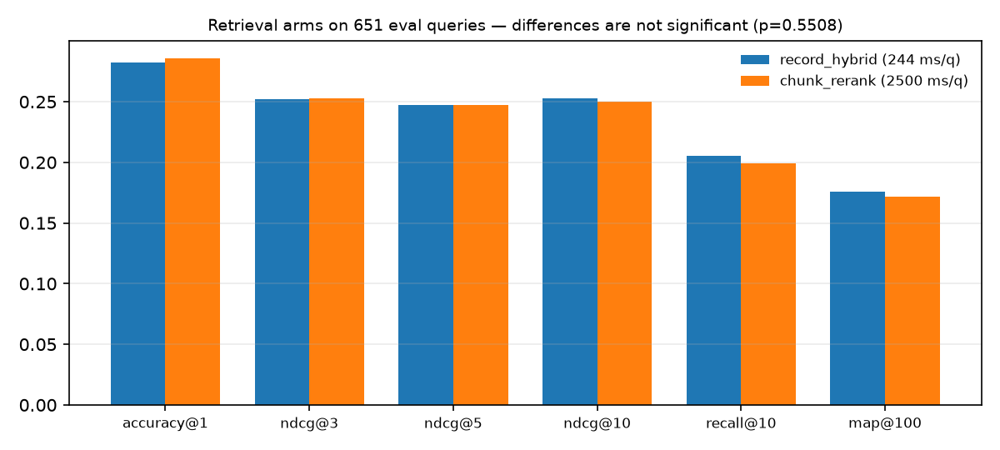

# POKnowledgeBase_ETL

[](https://www.python.org/)
[](https://airflow.apache.org/)
[](https://neo4j.com/)
[](https://qdrant.tech/)
[](https://docs.docker.com/compose/)
[](LICENSE)
[](https://nbviewer.org/github/yoyo4581/POKnowledgeBase_ETL/blob/main/Finetune_BioBERT_Colab.ipynb)

The knowledge-base ETL behind **PathwayOracle**. It builds and maintains a Neo4j
knowledge graph from Reactome, Gene Ontology and UniProt, plus a Qdrant vector
store of protein-function text, and keeps both in step with their upstream
sources using change-data-capture.

The design question it answers is not "how do I load this data once" but **"how
do I tell what changed since last time, and prove it."**

---

## Run Current Database Builds


```bash
curl -sLO https://raw.githubusercontent.com/yoyo4581/POKnowledgeBase_ETL/main/compose.serve.yaml
docker compose -f compose.serve.yaml up -d
```

First start pulls ~440 MB of snapshots and restores them; it takes a few
minutes. After that:

| | |
|---|---|
| Qdrant | <http://localhost:6333> — REST, and `/dashboard` in a browser |
| Neo4j Browser | <http://localhost:7474> — no login |
| Neo4j Bolt | `bolt://localhost:7687` |

What you get: **122,347 nodes / 602,142 relationships** in the graph, and
**10,204 protein records / 42,714 chunks** in the vector store.

<details>
<summary>What it is doing</summary>

Five services, three of which exit once their job is done:

| service | role |
|---|---|
| `fetch` | downloads the release assets, verifies `SHA256SUMS` |
| `qdrant` / `neo4j` | the databases |
| `qdrant-load` | uploads both snapshots, skipping collections already present |
| `neo4j-load` | restores the dump **before** the server starts — `neo4j-admin` needs the store to itself, and Community has no online restore |

Ordering is `depends_on: { condition: service_completed_successfully }`, so
`up` blocks until the data is in.

Everything is idempotent: a second `up` prints `have SHA256SUMS`, `already
present`, `graph already loaded` and finishes in seconds. Both ports bind to
`127.0.0.1` only, which is the reason Neo4j ships with `NEO4J_AUTH: none` —
nothing off the machine can reach it. Override `QDRANT_REST_PORT`,
`NEO4J_HTTP_PORT` or `NEO4J_BOLT_PORT` if something already owns them.

</details>

> [!TIP]
> `docker compose -f compose.serve.yaml down` stops everything and keeps the
> data. Only `down -v` discards it — which is also how you upgrade to a newer
> release.

This is the serving path. To **rebuild** the knowledge base from Reactome, GO
and UniProt, you need the repo, Airflow and SQL Server — see
[Quickstart](#quickstart).

---

## Contents

- [Run it](#run-it) — serving stack, one command
- [Overview](#overview)
- [Quickstart](#quickstart) — building it yourself
- [Exploring the data](#exploring-the-data)
- [Architecture](#architecture)
- [BioBERT fine-tuning](#biobert-fine-tuning)
- [Repository layout](#repository-layout)
- [Known gaps](#known-gaps)

---

## Overview

Upstream biology sources are not static. Reactome re-releases quarterly, GO
updates continuously, UniProt re-annotates. A graph rebuilt from scratch each
time tells you nothing about *what moved*; a graph updated in place drifts
silently away from its sources. This repo treats every load as a diff.



### Why CDC, concretely

Every table is loaded through the same three-schema cycle. Rows for the current
run land in `staging`. A single `MERGE` reconciles them into `dbo`, and SQL
Server's `OUTPUT` clause captures what that merge actually did into `diff`,
tagged with the action and the run id. The graph loaders then read `diff`, not
`dbo` — so a run that changes nothing writes nothing to Neo4j.

What makes the diff trustworthy is how a row's identity is defined:

| Sync strategy | Identity | Deletes | Used by |
|---|---|---|---|
| `DiffSync` | the table's primary key | no | keyed annotation tables (`GeneData`, `reactions`, …) |
| `IdentityHashSync` | `HASHBYTES` over named columns | yes, **coverage-scoped** | every edge table (`entity_membership`, `gene_edges`, …) |
| `CompositeKeySync` | a declared composite key | yes, coverage-scoped | multi-column keyed tables |
| `DefaultSync` | none — append only | no | `FunctionData` |

"Coverage-scoped" is the part that makes drift detectable. An edge table
declares `coverage_scope_columns=("pathway_id",)`. When the merge runs, any row
in `dbo` whose `pathway_id` appears in staging but whose identity hash does
*not* is deleted and recorded as a `DELETE` in the diff. That is how an edge
Reactome *removed* propagates — without it, retractions would be invisible and
the graph would only ever grow.

> [!NOTE]
> The scope column is what bounds the delete. Without it a partial load would
> delete everything absent from this batch; with it, only the pathways actually
> re-derived are in scope.

### Graph at a glance

Live figures from the build of **2026-10-01**, `pathway_source=reactome`:

| | count |
|---|---:|
| Nodes | 84,255 |
| Relationships (structural) | 193,078 |
| Pathways ingested | 2,035 (leaf pathways of 2,883) |
| Reactions | 13,652 |
| Genes (UniProt-keyed) | 10,561 |
| SQL tables under CDC | 19 |
| Airflow DAGs | 16 |


---

## Quickstart

This is the **build** path — the one that regenerates the knowledge base from
source. If you only want to query it, use [Run it](#run-it) instead: one file,
one command, no clone.

`docker-compose.yml` is not the same file as `compose.serve.yaml`. This one
builds databases and produces snapshots, so it bind-mounts repo directories
and carries the dump/load one-shots. The ETL itself does **not** run in
Docker: Airflow and SQL Server run on the host.

### Prerequisites

| | |
|---|---|
| Docker Compose | v2 |
| Disk | ~1 GB for the graph volume, ~100 MB for Qdrant storage |
| Memory | Neo4j is configured for **2 GB heap + 1 GB pagecache**, so give Docker ≥ 4 GB |

### 1. Configure

```bash
cp .env.example .env
```

Both containers ship with **no Neo4j password** (`NEO4J_AUTH: none`), which is
safe only because every port binds to `127.0.0.1`. Leave it alone unless you
widen the ports — and if you do, set it *before* the first start.

> [!IMPORTANT]
> `NEO4J_AUTH` is read **only when the data volume is empty**. After the first
> start, auth is whatever it was then — including after loading a dump, since a
> dump covers the `neo4j` database and not `system`. Changing it later takes
> `neo4j-admin dbms set-initial-password` or `down -v`.

Override the ports in `.env` if something already owns them. A local Neo4j
Desktop install holds **7474 and 7687**, and a second Desktop instance takes
7688 — in which case pick free ones and point `NEO4J_CONTAINER_URI` at the
same place:

```bash
NEO4J_HTTP_PORT="7475"
NEO4J_BOLT_PORT="7689"
NEO4J_CONTAINER_URI="bolt://localhost:7689"
```

### 2. Start the services

```bash
docker compose up -d qdrant neo4j
curl localhost:6333/readyz        # Qdrant
curl -s localhost:7474 >/dev/null && echo "neo4j up"
```

| Service | Image | Ports | Volume |
|---|---|---|---|
| `qdrant` | `qdrant/qdrant:v1.19.1` | `6333` REST, `6334` gRPC | `qdrant_storage:/qdrant/storage` |
| `neo4j` | `neo4j:5.19.0-community` | `7474` HTTP/Browser, `7687` Bolt | `neo4j_data:/data`, `neo4j_logs:/logs`, `./data/neo4j/dumps:/dumps` |

All ports bind to `127.0.0.1`, not `0.0.0.0` — a bare `"6333:6333"` publishes
to every interface, which with no API key means an unauthenticated store
anyone routable can read and write.

Both declare healthchecks (`interval 10s`, `retries 12`); Neo4j allows a 40 s
start period. Qdrant probes `/readyz` rather than `/healthz` deliberately —
`healthz` answers as soon as the process is alive, `readyz` waits until
collections are loadable, which is the condition a restore needs.

Neo4j loads the **APOC** plugin (`NEO4J_PLUGINS: '["apoc"]'`). The ETL's
ontology annotation uses `apoc.periodic.iterate`, so writes require it; serving
reads do not.

### 3. Load a graph dump

Put `neo4j.dump` in `data/neo4j/dumps/`, then:

```bash
docker compose stop neo4j
docker compose --profile load run --rm neo4j-load
docker compose start neo4j
```

The loader is behind a Compose **profile** so a plain `up` can never re-import
and undo whatever the server has done since. The server must be stopped — both
mount `/data`, and `neo4j-admin` needs the store to itself. Dumping back out is
symmetric, with `--profile dump`.

> [!CAUTION]
> The graph lives in the `neo4j_data` named volume, not in the dump. It survives
> `stop`, `start`, `restart`, `down` and reboots. **`docker compose down -v`
> destroys it.** That is the command never to type by reflex.

### Running the ETL

Airflow and SQL Server are host services. Required `.env` keys:

| Key | Purpose |
|---|---|
| `pathway_source` | `reactome` (default) or `kegg` — selects the schema and DAG lineage |
| `sql_server`, `gene_database`, `sql_uid`, `sql_pwd` | SQL Server connection (needs ODBC Driver 18) |
| `uuid` | run id stamped onto every staged and diffed row |
| `NEO4J_URI`, `NEO4J_USERNAME`, `NEO4J_PASSWORD` | graph target, e.g. `bolt://localhost:7687` |
| `GITHUB_TOKEN`, `GITHUB_DATASET_REPO` | publishing the training dataset as a release asset |
| `QDRANT_URL` *or* `QDRANT_PATH` | server mode vs embedded folder |
| `BIOBERT_MODEL_PATH` | encoder for the vector store |

```bash
pip install -r requirements.txt     # or requirements.lock.txt for exact pins
airflow dags trigger reactome_meta_build
```

Only `reactome_meta_build` is triggered by hand; everything downstream fires on
assets. See [the DAG graph](#dag-graph).

> [!TIP]
> `pathway_source` and `gene_database` must agree. Six table names exist in both
> the KEGG and Reactome schemas with different columns, so pointing Reactome
> code at a KEGG database fails at upsert, not at import.

---

## Exploring the data

### Neo4j Browser

Open <http://localhost:7474>, connect over `bolt://localhost:7687`.

Every node the ETL writes carries a shared **`:Entity`** label alongside its
class label (`:Protein`, `:Complex`, `:DefinedSet`, `:SmallMolecule`,
`:Gene`, `:Reaction`, `:Pathway`, …), because an edge endpoint can be any of a
dozen classes and the edge row does not say which.

A protein's identity and its states are deliberately separate nodes — `WEE1` and
`p-WEE1` are two `:Protein` entities, both `IS_FORM_OF` the one `:Gene`:

```cypher
// TP53's physical states across the graph
MATCH (e:Entity)-[:IS_FORM_OF]->(g:Gene {id: 'P04637'})
RETURN e.id, e.name, e.compartment
LIMIT 25;
```

```cypher
// Which complexes is TP53 a component of?  -> 106
MATCH (:Gene {id: 'P04637'})<-[:IS_FORM_OF]-(e:Entity)
      -[:HAS_COMPONENT*1..3]->(c:Complex)
RETURN count(DISTINCT c) AS complexes;
```

```cypher
// Read a reaction in one traversal: reactants in, products out
MATCH (r:Reaction {id: 'R-HSA-6804879'})
OPTIONAL MATCH (sub:Entity)-[:REACTANT]->(r)
OPTIONAL MATCH (r)-[:PRODUCT]->(prod:Entity)
OPTIONAL MATCH (cat:Entity)-[:CATALYST]->(r)
RETURN r.name, collect(DISTINCT sub.name) AS reactants,
       collect(DISTINCT prod.name) AS products,
       collect(DISTINCT cat.name)  AS catalysts;
```

```cypher
// Pathway membership, by size
MATCH (e:Entity)-[:IN_PATHWAY]->(p:Pathway)
RETURN p.name, count(e) AS entities
ORDER BY entities DESC LIMIT 10;
```

Relationship types currently in the graph:

| Type | Count | Meaning |
|---|---:|---|
| `IN_PATHWAY` | 36,085 | entity → pathway |
| `HAS_COMPONENT` | 35,054 | complex/polymer → part |
| `IS_FORM_OF` | 34,069 | physical state → gene/compound identity |
| `REACTANT` | 26,395 | entity → reaction |
| `HAS_MEMBER` | 23,388 | defined set → member |
| `PRODUCT` | 21,022 | reaction → entity |
| `HAS_CANDIDATE` | 7,960 | candidate set → member |
| `CATALYST` | 5,803 | enzyme → reaction |
| `STIMULATOR` | 1,907 | positive regulator → reaction |
| `INHIBITOR` | 894 | negative regulator → reaction |
| `HAS_MOIETY` | 501 | entity → attached moiety |

Layer-2 gene–gene edges (`ACTS_ON`, `ACTS_ON_CHEMICAL`, `ASSOCIATED_WITH`) are
derived from the above and are currently being rebuilt — see
[Known gaps](#known-gaps).

### Qdrant

Dashboard: <http://localhost:6333/dashboard>. Two collections:

| Collection | Granularity | Point id |
|---|---|---|
| `function_records` | one point per UniProt accession | `uuid5(NAMESPACE_URL, uniprot_id)` |
| `function_chunks` | sliding windows over the function text | `uuid5` of accession + chunk index |

Both carry a **dense** vector (768-d, cosine, from the fine-tuned BioBERT) and a
**sparse** BM25 vector (`Qdrant/bm25`, IDF modifier, `k=1.2`, `b=0.75`). Sparse
vectors are re-derived from payload text on restore, since BM25 term frequency
is corpus-independent.

```bash
curl -s localhost:6333/collections | jq '.result.collections[].name'
curl -s localhost:6333/collections/function_records | jq '.result.points_count'
```

### Through the MCP server

`src/builders/Qdrant/mcp_server.py` exposes the store as an MCP toolkit shaped
around how an agent actually works a question — a funnel, not a single lookup:

| Tool | Use |
|---|---|
| `search_proteins` | shortlist accessions, each with its best snippet as evidence |
| `read_snippets` | more windows from one protein, re-scored against a *different* question |
| `expand_snippet` | widen a promising window outward in sentences |
| `read_record` | give up on windows, read the whole function text |
| `collection_info` | what is actually indexed |

```jsonc
{"mcpServers": {"protein-retrieval": {
  "command": "python",
  "args": ["src/builders/Qdrant/mcp_server.py"],
  "env": {"QDRANT_URL": "http://localhost:6333",
          "BIOBERT_MODEL_PATH": "EmbeddingModel/biobert-go-retrieval"}}}}
```

Every tool speaks UniProt accessions, so a result can be fed straight into the
next call.

> [!NOTE]
> Embedded mode (`QDRANT_PATH`) takes an exclusive lock on the storage folder —
> one process at a time. Point `QDRANT_URL` at the container for concurrent use.

---

## Architecture

### The sync core

Two orthogonal strategy hierarchies. A `SyncStrategy` decides **what a row's
identity is** and what the diff should say; a `DbOpsStrategy` decides **what SQL
to emit**. `TableManager` binds one of each to a `TableSchema`.



Strategy selection is automatic, in `table_registry._select_strategy`:
constraints win over sync type, because `SQLStageUpsertConstraints` degrades
gracefully for tables with plain foreign keys.

<details>
<summary><b>Full UML</b> — generated with <code>pyreverse -o mmd</code></summary>

Regenerate with:

```bash
pyreverse -o mmd -p SQLCore -d docs/assets \
  src/builders/SQL/schema/types.py \
  src/builders/SQL/schema/strategies \
  src/builders/SQL/schema/table_registry.py
```



</details>

```mermaid
classDiagram
  class StagingQuery {
    sql : str
    insert_cols : tuple~str~
    match_cols : tuple~str~
    num_params : int
  }
  class SyncStrategy {
    dedup_match_columns(schema) tuple~str~
    diff_output_clause(schema, target_table, run_id)* str
    insert_columns(schema) list~str~
    insert_values(schema) list~str~
    key_clause(schema) str
    match_clause(schema, target_table)* str
  }
  class IdentityHashSync {
    coverage_scope_columns : tuple~str~
    identity_hash : tuple~str~
    dedup_match_columns(schema) tuple~str~
    diff_output_clause(schema, target_table, run_id) str
    insert_columns(schema) list~str~
    insert_values(schema) list~str~
    key_clause(schema) str
    match_clause(schema, target_table) str
  }
  class CompositeKeySync {
    coverage_scope_columns : tuple~str~
    dedup_match_columns(schema) tuple~str~
    diff_output_clause(schema, target_table, run_id) str
    key_clause(schema) str
    match_clause(schema, target_table) str
  }
  class DiffSync {
    diff_columns : tuple~str~
    diff_output_clause(schema, target_table, run_id) str
    match_clause(schema, target_table) str
  }
  class DefaultSync {
    diff_output_clause(schema, target_table, run_id) str
    match_clause(schema, target_table) str
  }
  class DbOpsStrategy {
    build_merge_query(schema, run_id) str
    compute_identity_hashes(schema, sync) str
    create_indexes(schema, kind) list~str~
    create_table(schema, kind) str
    stage_data(schema)* StagingQuery
    upsert_data(schema, run_id)* list~str~
    wipe_data(schema, kind) str
  }
  class SQLStageUpsert {
    stage_data(schema) StagingQuery
    upsert_data(schema, run_id) list~str~
  }
  class SQLStageUpsertDiff {
    stage_data(schema) StagingQuery
    upsert_data(schema, run_id) list~str~
  }
  class SQLStageUpsertConstraints {
    stage_data(schema) StagingQuery
    upsert_data(schema, run_id) list~str~
  }
  class TableManager {
    schema : TableSchema
    strategy : DbOpsStrategy
    create_diff_table() str
    create_production_environment() list~str~
    create_staging_environment() list~str~
    create_staging_table() str
    wipe_staging_environment() list~str~
  }
  class TableSchema {
    auto_id : bool
    columns : Mapping
    constraints : tuple~Constraint~
    key : Optional
    sync
  }
  class ForeignKey {
    name : str
    columns : tuple~str~
    ref_table : str
    ref_columns : tuple~str~
    deferred : Optional~DeferredResolution~
    on_delete : Optional~str~
    to_sql() str
  }
  class DeferredResolution {
    match_columns : tuple~str~
    staging_columns : tuple~str~
  }
  class UniqueConstraint {
    name : str
    columns : tuple~str~
    to_sql() str
  }
  class CheckConstraint {
    name : str
    expression : str
    to_sql() str
  }
  class PrimaryCompositeKey {
    columns : tuple~str~
  }
  class ColumnPlan {
    production_col : str
    staging_col : str
    staging_type : str
    reused_column : bool
    deffered_fk : Optional~ForeignKey~
  }
  class TableClearOrder {
    order : list~str~
    levels : list
    cycles : list~set~
    self_refs : set~str~
  }
  class DBSchema {
    <<enumeration>>
    PRODUCTION
    STAGING
    DIFF
  }

  SyncStrategy <|-- IdentityHashSync
  SyncStrategy <|-- CompositeKeySync
  SyncStrategy <|-- DiffSync
  SyncStrategy <|-- DefaultSync
  DbOpsStrategy <|-- SQLStageUpsert
  DbOpsStrategy <|-- SQLStageUpsertDiff
  DbOpsStrategy <|-- SQLStageUpsertConstraints
  TableSchema --> SyncStrategy : sync
  TableSchema --> PrimaryCompositeKey : key
  TableSchema --> ForeignKey : constraints
  ForeignKey --> DeferredResolution : deferred
  TableManager --> TableSchema : schema
  TableManager --> DbOpsStrategy : strategy
  DbOpsStrategy --> StagingQuery : returns
  DbOpsStrategy --> DBSchema : kind
  DbOpsStrategy --> ColumnPlan : plans
```

### Special case: deferred FK resolution

Self-referencing hierarchy tables cannot be staged with their foreign key
already resolved, because the parent's surrogate id does not exist until the
parent row is inserted. `DeferredResolution` declares the natural key to match
on instead, and `SQLStageUpsertConstraints` rewrites the `USING` clause to join
staging against production on that natural key at merge time:

```python
ForeignKey(
    name="fk_parent",
    columns=("parent_id",),
    ref_table="kegg_class",
    ref_columns=("class_id",),
    deferred=DeferredResolution(
        match_columns=("name",),          # production column to match
        staging_columns=("parent_name",), # staging column holding the value
    ),
)
```

The Reactome port sidesteps this: `pathway_class` is keyed on Reactome's own
`stId` rather than a surrogate id, so there is nothing to defer. Reactome event
names are not unique (≈19k events share ≈18.8k names), so a name match would
bind some children to the wrong parent.

### Table inventory

19 tables under CDC with `pathway_source=reactome`:

| Table | Sync | Executor | Rows |
|---|---|---|---:|
| `entities` | `DiffSync` | `SQLStageUpsertDiff` | 84,253 |
| `gene_xref` | `IdentityHashSync` | `SQLStageUpsertDiff` | 112,721 |
| `entity_membership` | `IdentityHashSync` | `SQLStageUpsertDiff` | 109,654 |
| `reaction_participants` | `IdentityHashSync` | `SQLStageUpsertDiff` | 58,575 |
| `EntityData` | `DiffSync` | `SQLStageUpsertDiff` | 55,214 |
| `EntityPathMem` | `IdentityHashSync` | `SQLStageUpsertDiff` | 36,085 |
| `entity_identity` | `IdentityHashSync` | `SQLStageUpsertDiff` | 34,069 |
| `reactions` | `DiffSync` | `SQLStageUpsertDiff` | 13,652 |
| `GeneData` | `DiffSync` | `SQLStageUpsertDiff` | 10,561 |
| `pathway_class` | `IdentityHashSync` | `SQLStageUpsertDiff` | 2,883 |
| `PathwayIds` | `DiffSync` | `SQLStageUpsertDiff` | 2,035 |
| `PathwayData` | `DiffSync` | **`SQLStageUpsertConstraints`** | 2,035 |
| `PathwaySBMLMeta` | `DiffSync` | `SQLStageUpsertDiff` | 2,035 |
| `CompoundData` | `DiffSync` | `SQLStageUpsertDiff` | 1,818 |
| `DrugData` | `DiffSync` | `SQLStageUpsertDiff` | 975 |
| `entity_moiety` | `IdentityHashSync` | `SQLStageUpsertDiff` | 501 |
| `gene_edges` | `IdentityHashSync` | `SQLStageUpsertDiff` | 142547 |
| `FunctionData` | `DefaultSync` | `SQLStageUpsert` | — |
| `GOOntologyMeta` | `IdentityHashSync` | `SQLStageUpsertDiff` | 0 |

Schemas are selected, not merged: `definitions.py` picks `reactome_definitions`
or `kegg_definitions` from `pathway_source` and merges in `shared_definitions`
(the source-neutral spine: `PathwayIds`, `entities`, `EntityPathMem`,
`FunctionData`, `GOOntologyMeta`). Six table names exist in both source sets
with different columns, which is why they replace rather than combine.

### DAG graph



Only `reactome_meta_build` is triggered by hand; the rest fire on Airflow
assets. The four `kegg_*` DAGs plus `go_ontology_annotation` form the legacy
lineage — still present and runnable via `pathway_source=kegg`, but superseded.
Pause them in the UI to avoid writing KEGG-shaped rows into a Reactome database.

`entrez_uniprot_annotation` serves both sources and is **not** legacy. It owns
`dbo.EntrezUniprotMap` and pushes the opposite id form onto each Gene node:
`uniprot_ids` under KEGG (which keys genes by Entrez id), `entrez_ids` under
Reactome (which keys them by accession). Under Reactome that id is a lookup
qualifier rather than a join key, and it rides down to the Qdrant record
payload so a caller holding either id form can reach the same record. About
95% of genes carry one; the rest have no Entrez mapping and omit the field.

<details>
<summary>All 16 DAGs</summary>

| DAG | Schedule | Emits |
|---|---|---|
| `reactome_meta_build` | manual | `reactome://pathway_sbml_batched` |
| `reactome_structure` | asset | `reactome://structure_complete` |
| `reactome_gene_edges` | asset | `reactome://gene_edges_complete` |
| `reactome_ontology_annotation` | asset | `neo4j://kgml_complete` |
| `go_ontology_network` | `@monthly` | `go://structure_complete` |
| `neo4j_snapshot` | asset | `neo4j://container_live` |
| `embedding_dataset_export` | asset | `qdrant://dataset_export` |
| `embedding_drift_check` | asset | `qdrant://retrain_needed` |
| `qdrant_collection_build` | manual | `qdrant://collections_live` |
| `function_data_build` | manual | — |
| `wipe_sql_environment` | manual | — |
| `kegg_meta_build` *(legacy)* | manual | `kegg://pathway_kgml_batched` |
| `kgml_structure_annotation` *(legacy)* | asset | `kegg://structure_complete` |
| `kgml_entity_annotation` *(legacy)* | asset | — |
| `go_ontology_annotation` *(legacy)* | asset | `neo4j://kgml_complete` |
| `entrez_uniprot_annotation` | manual | — |

</details>

### One CDC cycle



The staging table is cleared after every batch, so it never holds more than one
batch's rows. The diff accumulates across the run and is read once at the end by
the graph loaders.

> [!WARNING]
> A staging batch must never split a coverage scope. If half a pathway's edges
> are staged in one batch and half in the next, the second batch's
> coverage-scoped delete retracts what the first just wrote. Consumers therefore
> batch by *record* (one whole pathway), never by row.

---

## BioBERT fine-tuning

The vector store is searched with a BioBERT encoder fine-tuned on Gene Ontology
annotations, so that "what does this protein do" retrieves on function rather
than on lexical overlap.

[](https://nbviewer.org/github/yoyo4581/POKnowledgeBase_ETL/blob/main/Finetune_BioBERT_Colab.ipynb)



### Supervision from the ontology

Training pairs are built from GO annotations, not from free text. An **anchor**
is a GO term; its **positives** are the proteins annotated to it; **negatives**
are drawn three ways, which is what stops the model collapsing onto topic
similarity:

| Negative source | Count | Rationale |
|---|---:|---|
| `neg_sibling` | 34,671 | sibling GO terms — hard negatives, close in the ontology |
| `neg_curated_NOT` | 2,734 | curated `NOT` qualifiers — the ontology asserting non-membership |
| `neg_random` | 1,575 | random proteins — easy negatives for stability |

Filtering, from the exported `stats.json`:

| | |
|---|---:|
| Dropped: weak evidence codes | 59,650 |
| Dropped: indirect qualifiers | 1,601 |
| Dropped: `NOT` conflicts | 234 |
| Eligible GO terms | 12,153 |
| Rejected — fewer than 3 positives | 5,335 |
| Rejected — more than 50 positives | 305 |
| **Anchors total** | **6,513** |
| → train | 3,441 |
| → held out | 651 |
| → lost to the buffer | 2,421 |
| **Training triplets** | **38,980** |
| Corpus accessions | 6,019 |

Held-out GO terms are excluded entirely from training, so evaluation measures
generalisation to unseen function categories rather than memorisation.

### Training setup

| | |
|---|---|
| Base model | `dmis-lab/biobert-base-cased-v1.2` |
| Hardware | 1 × NVIDIA A100-SXM4-40GB |
| Epochs / steps | 10 / 390 |
| Batch size | 1,024 (`mini_batch_num_tokens=65536`) |
| Wall clock | 1,330 s (≈22 min) |
| Peak GPU memory | 27.52 GB |
| Final train loss | 4.546 |
| Best checkpoint | `checkpoint-390`, by `heldout_go_cosine_ndcg@10` |
| Embedding dim | 768, cosine |

### Results

Held-out retrieval, 651 unseen GO terms against the 6,019-accession corpus:



| Metric | @1 | @3 | @5 | @10 |
|---|---:|---:|---:|---:|
| Accuracy | 0.2289 | 0.4178 | 0.4854 | 0.6329 |
| Precision | 0.2289 | 0.2207 | 0.1985 | 0.1697 |
| Recall | 0.0290 | 0.0856 | 0.1191 | 0.1888 |
| nDCG@10 | | | | **0.2308** |
| MRR@10 | | | | 0.3470 |
| MAP@100 | | | | 0.1637 |

Then the end-to-end retrieval comparison over the same 651 queries, run through
the MCP server — a one-stage hybrid search versus a two-stage chunk re-rank:



| Metric | `record_hybrid` | `chunk_rerank` | Δ |
|---|---:|---:|---:|
| accuracy@1 | 0.2826 | 0.2857 | +0.0031 |
| ndcg@3 | 0.2519 | 0.2528 | +0.0009 |
| ndcg@5 | 0.2471 | 0.2472 | +0.0001 |
| ndcg@10 | **0.2526** | 0.2497 | −0.0029 |
| recall@10 | 0.2054 | 0.1993 | −0.0062 |
| map@100 | 0.1761 | 0.1716 | −0.0045 |
| median latency | **244 ms** | 2,500 ms | 10× |

Paired bootstrap on nDCG@10, 10,000 resamples:

$$\Delta_{\text{ndcg@10}} = -0.0029,\quad 95\%\ \text{CI}\ [-0.0125,\ +0.0067],\quad p = 0.5508$$

217 queries better, 232 worse, 202 unchanged. **The interval spans zero**: this
eval set cannot distinguish the two arms, so the 10× cheaper `record_hybrid` arm
is the one to serve.

`qdrant_collection_build` gates promotion on exactly one number —
`summary[record_hybrid]["ndcg@10"]` — against `QDRANT_GATE_FLOOR`:

| Gate setting | Env var | Default | This build |
|---|---|---|---|
| Arm | `QDRANT_GATE_ARM` | `record_hybrid` | `record_hybrid` |
| Metric | `QDRANT_GATE_METRIC` | `ndcg@10` | 0.2526 |
| Floor | `QDRANT_GATE_FLOOR` | **0.15** | **passes** |

> [!CAUTION]
> The notebook prints *"refuses to promote a build below QDRANT_GATE_FLOOR
> (default 0.35) … if this is under that, do not ship it."* That message is
> **stale**: [`dags/qdrant_build.py:94`](dags/qdrant_build.py) reads
> `float(os.getenv("QDRANT_GATE_FLOOR", "0.15"))`. At 0.2526 the build clears
> the real floor comfortably. Trust the DAG, not the notebook's prose.

There is **no pre-fine-tune baseline** in the notebook, so the gain attributable
to fine-tuning is not measured — only the trajectory across epochs, which rises
from nDCG@10 0.1716 (epoch 1) to 0.2305 (epoch 10).

### Chunking

| | |
|---|---|
| Corpus | 6,019 accessions → 19,883 chunks |
| Window / stride | 2 sentences / 1 (3.3 chunks per record) |
| Artifacts | `biobert-go-retrieval.zip` 171.5 MB, `qdrant_store.zip` 55.7 MB, `qdrant_export.zip` 38.4 MB |

---

## Repository layout

```text
├── dags/                         16 Airflow DAGs
│   ├── reactome_routine.py       Reactome lineage (current)
│   ├── routine.py                KEGG lineage (legacy)
│   ├── ontology_build.py         GO structure + annotation
│   ├── embedding_dataset.py      training-set export + drift check
│   ├── qdrant_build.py           collection build, gate, promote
│   └── neo4j_snapshot.py         dump → container
├── src/
│   ├── parsers/                  source clients: Reactome, KEGG, GO, UniProt
│   ├── models/                   dataclasses on BaseSQLObject, one per table
│   ├── builders/
│   │   ├── SQL/                  SQLCaller, SQLState, schema/ + strategies/
│   │   ├── Neo4j/                Neo4jCaller, node/edge schema, ontology sync
│   │   └── Qdrant/               core/, build/, analysis/, mcp_server.py
│   └── workflow/                 producers + consumers wiring parse → SQL
├── EmbeddingModel/
│   ├── BioBERT_Files/            train.py, dataset.py
│   └── biobert-go-retrieval/     fine-tuned encoder
├── notebooks/                    stack_smoke_test.ipynb + scratch
├── scripts/                      one-off probes, not part of any DAG
├── docs/assets/                  generated figures
├── data/                         gitignored, but snapshots/ + dumps/ are
│                                 tracked-empty so Docker does not create
│                                 them as root
├── docker-compose.yml            qdrant + neo4j (+ load profiles)
├── .env.example                  copy to .env
└── Finetune_BioBERT_Colab.ipynb
```

